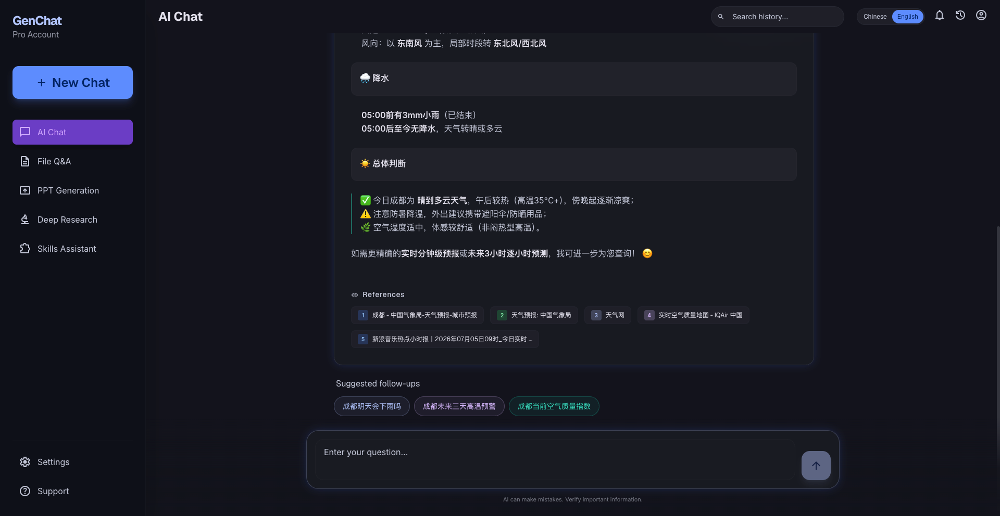
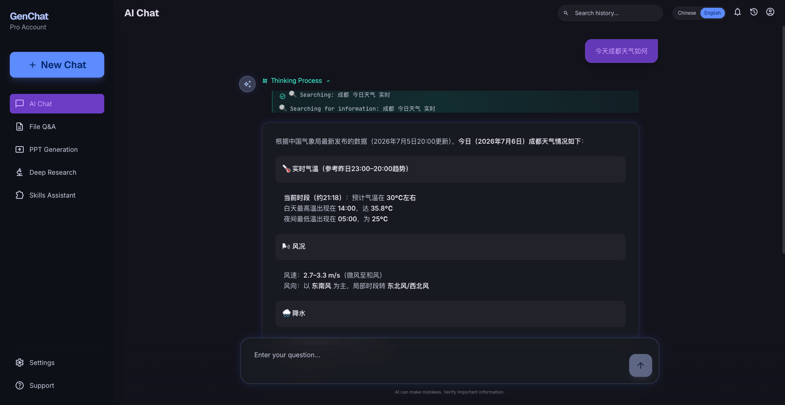
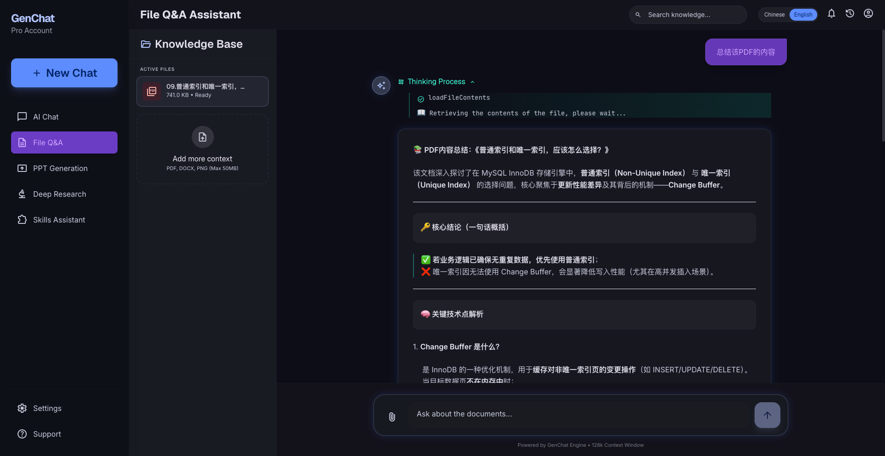
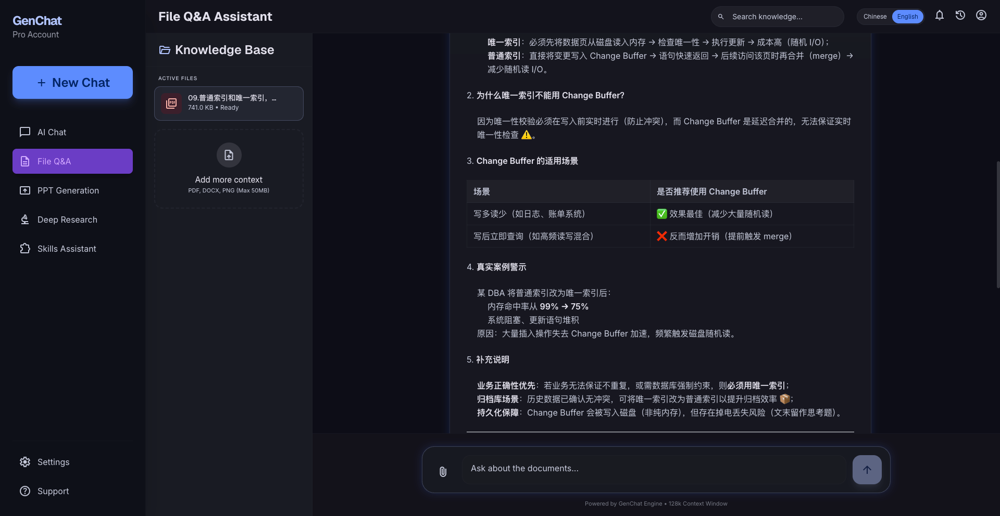
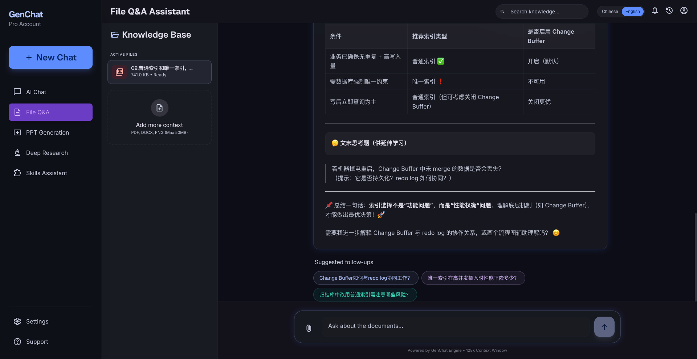
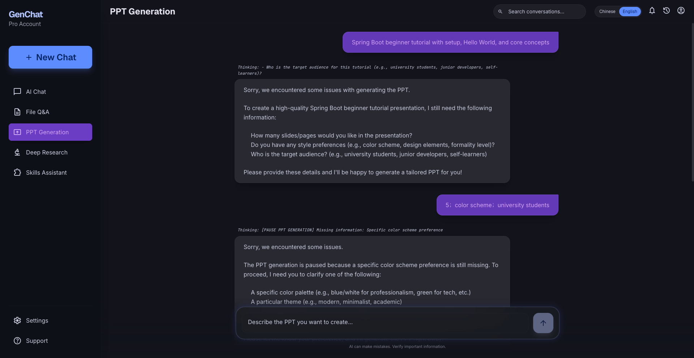
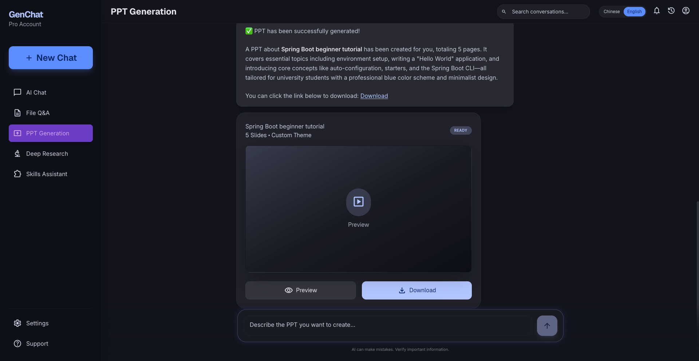
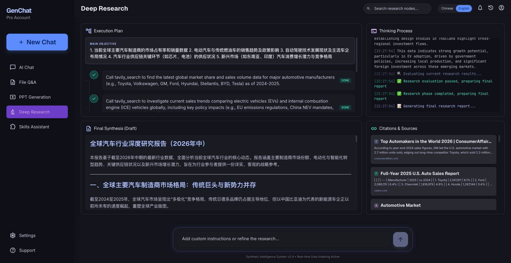
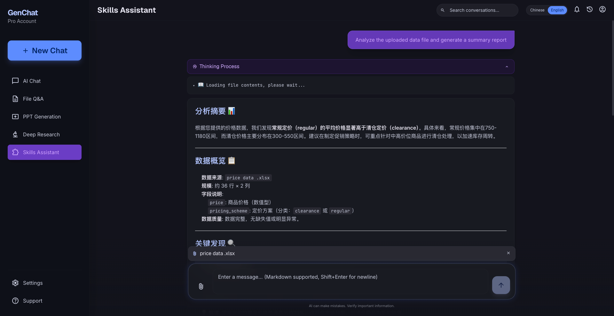
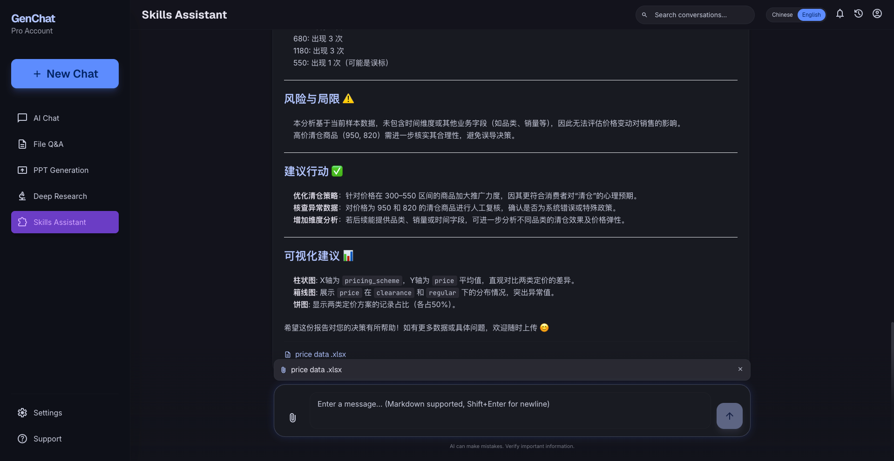

# GenChat - 智能对话应用平台
<p align="center">
  <a href="README.md">中文</a> | <a href="README_EN.md">English</a>
</p>
<p align="center">
  
  
  
  
  
  
</p>

## 🎯 项目简介

GenChat 是一个基于 Spring AI 构建的智能对话应用平台，提供联网搜索、文件问答、PPT 生成、深度研究、Skills 技能助手等多种智能体模式，并配套 React 前端。平台旨在为企业用户和个人开发者提供一个开箱即用、高度可扩展的 AI 智能体解决方案。

**项目愿景**：打造一个功能全面、易于集成、生产可用的智能对话平台，助力企业在 AI 时代构建更智能的业务应用。

### ✨ 平台特色
- 🚀 **功能全面**：覆盖从基础对话到复杂研究的多层次 AI 应用场景
- 🏗️ **模块化架构**：后端采用 controller → application → agent/service 分层设计，六大智能体模式可独立演进
- 🔌 **能力可组合**：联网搜索、RAG 文件问答、PPT 状态机、Plan-Execute 深度研究等模块可单独使用或组合部署
- 🔧 **开发者友好**：基于 Spring Boot 生态，提供清晰的 REST / SSE 接口与可外部化配置
- 📦 **开箱即用**：预置会话管理、流式中断、Flyway 迁移等企业级实践，配套 Vite + React 前端

## 🔥 核心功能

### 🌐 智能联网对话
- **实时信息获取**：集成搜索引擎，突破大模型知识截止限制
- **结构化输出**：四段式交互设计（思考过程→回答正文→参考来源→推荐问题）
- **流式响应控制**：支持实时流式输出和智能中断控制
- **信息可追溯**：所有回答附带权威参考来源，确保信息可靠性

<p>
  <a href="images/ai-chat-1.png"></a>
</p>
<p>
  <a href="images/ai-chat-2.png"></a>
</p>
<p><em>支持边检索边回答，完整呈现思考链路、答案正文与来源引用，帮助快速获取可信信息。</em></p>

### 📁 多模态文件分析
- **全格式支持**：PDF、DOCX、TXT、PNG、JPG等常见文档格式
- **智能内容提取**：基于RAG技术实现大文件的高效语义检索
- **图片文字识别**：通过多模态大模型解析图片中的文字信息
- **上下文感知**：文件与对话会话自动关联，支持多轮深入问答

<p>
  <a href="images/file-qa-1.png"></a>
</p>
<p>
  <a href="images/file-qa-2.png"></a>
</p>
<p>
  <a href="images/file-qa-3.png"></a>
</p>
<p><em>上传文档后可进行多轮追问，结合语义检索与多模态解析，提升长文档与图片内容理解效率。</em></p>

### 📊 智能文档生成
- **需求驱动生成**：基于自然语言描述自动生成专业PPT文档
- **多模式输出**：
  - 模板填充模式：兼顾美观与可编辑性
  - 文生图模式：生成视觉效果出众的演示文稿
  - HTML转PPT：灵活定制样式布局
- **智能状态管理**：从需求澄清到成品输出的全流程状态控制
- **自动配图生成**：集成文生图服务，丰富文档视觉效果

<p>
  <a href="images/ppt-1.png"></a>
</p>
<p>
  <a href="images/ppt-2.png"></a>
</p>
<p>
  <a href="images/ppt-3.png"></a>
</p>
<p><em>从需求澄清到成品导出全流程可视化，支持多种生成模式与自动配图，快速产出可编辑演示文档。</em></p>

### 🔍 深度研究分析
- **智能规划执行**：基于Plan-Execute模式，自动拆解复杂问题
- **并行处理优化**：多任务并行执行，大幅提升研究效率
- **迭代优化机制**：评估-调整-再执行的循环优化策略
- **问题自动优化**：智能丰富和优化用户原始问题表述

<p>
  <a href="images/deep-research.png"></a>
</p>
<p><em>通过计划-执行闭环与并行任务调度，自动完成复杂问题拆解、资料整合与结果迭代优化。</em></p>

### 🧩 Skills 技能助手
- **可扩展技能目录**：通过 `skills.directory` 加载自定义 Skill，支持按需组合工具能力
- **多工具协同**：集成联网搜索、文件检索、Grep 等工具，适配复杂自动化任务
- **流式交互**：与其他智能体一致的 SSE 流式输出与中断控制

<p>
  <a href="images/skills-1.png"></a>
</p>
<p>
  <a href="images/skills-2.png"></a>
</p>
<p><em>支持按目录扩展技能与工具编排，适用于检索、分析、执行等自动化协同任务。</em></p>

## 🚀 快速开始

```bash
# 后端（默认端口 8080，需 Java 21）
./gradlew bootRun

# 前端（开发地址 http://localhost:5173）
cd frontend && npm install && npm run dev
```

运行前请配置 `application.yml` 中的 MySQL、Redis、OpenAI 兼容 API、Tavily、MinIO、PgVector 等连接信息（支持环境变量覆盖）。Agent 行为相关参数可通过 `genchat.*` 配置项调整（如 ReAct 轮次、会话记忆窗口、文件分块大小等）。

更多前端说明见 [`frontend/README.md`](frontend/README.md)。

## 🛠️ 技术栈

### 基础框架
| 组件 | 版本 | 核心作用 |
|------|------|----------|
| Java | 21 | 运行时 |
| Spring Boot | 3.5.6 | 应用基础框架，提供自动配置、依赖注入、Web容器等核心能力 |
| Spring AI | 1.1.0 | AI应用开发框架，封装LLM调用、工具集成、Prompt管理等能力 |
| MyBatis-Plus | 3.5.9 | 简化MySQL操作，提供CRUD封装、分页、条件查询等能力 |
| Flyway | - | 数据库版本迁移（`db/migration`） |

### 大模型服务
| 模型名称 | 类型 | 主要用途 |
|----------|------|----------|
| qwen-plus | 语言模型 | 核心大模型，负责自然语言理解、逻辑推理、内容生成（可通过 OpenAI 兼容接口配置其他模型） |
| qwen3-vl-plus | 多模态模型 | 全模态大模型，具备图像识别能力，用于图片内容解析 |
| nanobanana-pro | 文生图模型 | 生成高清4K图，效果好，用于PPT生成中的高质量配图 |
| qwen-image-plus | 文生图模型 | 生成简单配图，成本低，用于一般性图片生成需求 |
| embedding模型 | 向量模型 | 用于大文件向量化，支持文件问答的语义检索 |

### 数据存储组件
| 组件 | 版本 | 用途 |
|------|------|------|
| MySQL | 8.0.33 | 存储结构化数据：会话记录、文件元信息、PPT实例状态、模板配置等 |
| Redis | - | 分布式 Agent 任务状态与跨实例停止信号（Redisson） |
| MinIO | 8.6.0 | 对象存储服务：存储用户上传的文件、生成的PPT文件、图片等二进制数据 |
| PgVector | - | 向量存储，用于文件问答，存储大文件的分块内容向量 |

### 工具与中间件
| 分类 | 组件 | 版本 | 用途 |
|------|------|------|------|
| 工具集成 | MCP | - | Model Context Protocol，工具集成的标准协议，统一搜索引擎、文件检索等工具调用 |
| 文件处理 | Apache PDFBox | 3.0.4 | PDF文件文本提取 |
| 文件处理 | Apache POI | 5.3.0 | Word/Excel文件解析 |
| 文件处理 | python-pptx | - | 生成PPT文件的Python脚本 |
| 流式处理 | Reactor | - | SSE 流式输出与 Agent 任务生命周期管理 |
| 前端 | React + Vite | 19 / 6 | Web 界面，支持中英文切换 |

## ⭐ Star History

感谢所有Star本项目的小伙伴！您的认可是我们持续改进的动力。

[](https://star-history.com/#RayzCoding/GenChat&Date)

---

<p align="center">
  Made with ❤️ by GenChat Team
</p>